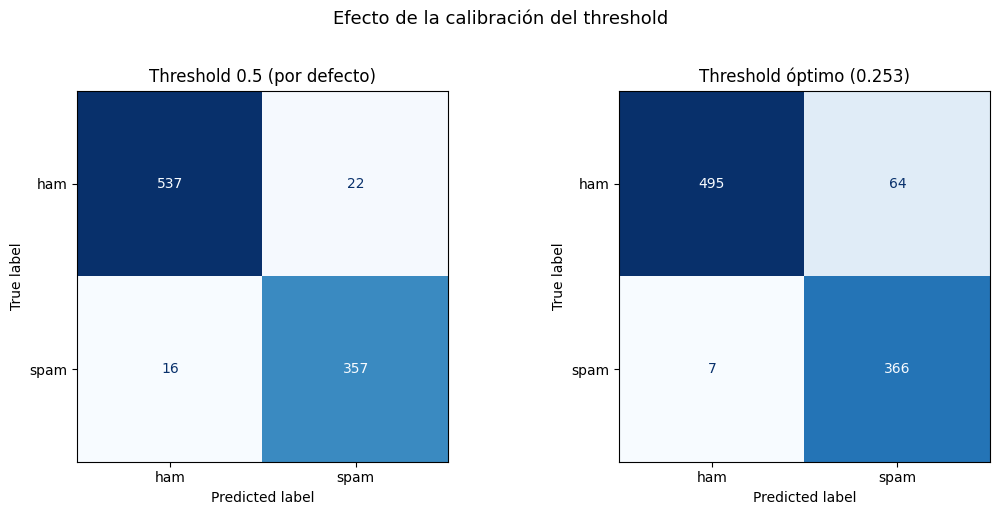

# Detector de Spam Bilingüe (Inglés + Español)
## Documento Técnico — Proyecto Final

---

**Universidad Nacional**
**Curso:** Inteligencia Artificial
**Profesor:** Venegas
**Integrante(s):** _______________________________
**Fecha de entrega:** 8 de junio de 2026

---

## 1. Introducción

El correo y la mensajería electrónica son hoy el principal vector de ataques de
*phishing*, fraude y publicidad no deseada. El **spam** no solo degrada la
experiencia del usuario: es la puerta de entrada a estafas bancarias, robo de
credenciales y distribución de malware. Filtrar automáticamente estos mensajes
es, por tanto, un problema de seguridad de primer orden.

Este proyecto construye un **agente inteligente** capaz de clasificar mensajes
como *spam* o *ham* (legítimo) de forma automática, usando técnicas de
Procesamiento de Lenguaje Natural (NLP) y aprendizaje supervisado. A diferencia
de los filtros basados en reglas fijas (*"si contiene FREE entonces spam"*),
nuestro agente **aprende** las regularidades del lenguaje del spam a partir de
datos, y generaliza a mensajes nunca vistos.

El sistema es **bilingüe** (inglés y español), una decisión deliberada: los
usuarios hispanohablantes reciben campañas de phishing localizadas (BBVA,
Santander, SAT, CFE, Mercado Libre) que un modelo entrenado solo en inglés no
detecta. Para que el español no fuera solo traducción, el corpus combina datos
traducidos, **spam español nativo** y un *seed* de phishing local. El entregable
incluye un notebook reproducible, un modelo serializado y un sistema interactivo
de predicción en Gradio.

## 2. Planteamiento del problema

La detección de spam se formula como un problema de **clasificación binaria
supervisada**. El agente aprende una función

$$f:\ \mathcal{X} \rightarrow \mathcal{Y}$$

que mapea el texto crudo de un mensaje a una etiqueta de clase.

| | Variable | Tipo | Dominio | Descripción |
|---|---|---|---|---|
| **Entrada** $\mathcal{X}$ | `text` | Texto libre | Cadena Unicode de longitud variable (EN/ES) | Contenido crudo del mensaje, con URLs, números y emojis |
| **Salida** $\mathcal{Y}$ | `label` | Categórica binaria | $\{\text{spam}, \text{ham}\}$ | Clase predicha |
| **Salida** (aux.) | `P(spam)` | Continua | $[0, 1]$ | Probabilidad estimada de spam |

**Regla de decisión:** se predice spam si $P(\text{spam}\mid\text{texto}) \ge t^{\star}$,
donde $t^{\star}$ es un umbral calibrado (no necesariamente 0.5).

### Análisis PEAS del agente

| Componente | Definición |
|---|---|
| **P — Performance** | Accuracy, Precision, Recall y F1. Métrica prioritaria: **Recall** sobre la clase *spam*. |
| **E — Environment** | Mensajes en inglés o español, con HTML, URLs, números y errores ortográficos. |
| **A — Actuators** | Etiqueta *spam*/*ham* + nivel de confianza $\in[0,1]$ + probabilidades por clase. |
| **S — Sensors** | El texto crudo del mensaje. |

**Tipo de entorno:** totalmente observable, un solo agente, determinístico,
episódico y estático. **Tipo de agente:** *model-based* — construye una
representación interna (pesos o probabilidades) durante el entrenamiento y la
aplica en inferencia.

> **¿Por qué priorizar Recall?** Un falso negativo (spam que llega a la bandeja
> de entrada) puede derivar en fraude o robo de credenciales; un falso positivo
> (un mensaje legítimo enviado a la carpeta de spam) es una molestia recuperable.
> En un contexto de seguridad, el costo asimétrico justifica maximizar la
> detección de spam aun a costa de bloquear algún mensaje legítimo.

## 3. Metodología

### 3.1 Datasets

Se combinaron **tres fuentes** para construir un corpus bilingüe que no dependa
únicamente de traducción automática:

| Dataset | Idioma | Fuente | Mensajes |
|---|---|---|---|
| SMS Spam Collection (UCI) | Inglés | Almeida & Hidalgo (2011) | 5 574 |
| SMS Multilingual (traducido) | Español | dbarbedillo (UCI traducido) | 5 572 |
| **spam_ham_spanish (nativo)** | Español | softecapps (spam escrito en español) | 1 207 |
| *Seed* de phishing local | Español | Curado manualmente (BBVA, SAT, CFE…) | 61 |

Tras la unión y la **deduplicación** por texto, el corpus reúne **~11 400
mensajes** con una proporción global de spam del **16.3 %** — un dataset
**desbalanceado**, fiel a la realidad (la mayoría del correo es legítimo). La
incorporación del **spam español nativo** sube la proporción de spam respecto a
una versión solo-traducida y aporta vocabulario de phishing genuino del español.

### 3.2 Preprocesamiento

Cada mensaje pasa por una función `clean_text` que:

1. Convierte a minúsculas.
2. Sustituye URLs por el token `__url__` y números por `__num__` (preservando la
   *señal* sin memorizar valores concretos).
3. Elimina HTML, puntuación y caracteres no informativos.
4. Filtra **stopwords** combinadas de inglés y español (**504** palabras de
   NLTK).

El reemplazo por *tokens* en lugar de la eliminación es una decisión clave: la
presencia de una URL o un número es altamente predictiva de spam, aunque su
valor exacto no lo sea.

### 3.3 Balanceo y partición

Para evitar que el modelo aprenda a predecir siempre *ham*, se aplicó
**undersampling** de la clase mayoritaria, llevando el corpus a **4 659
mensajes** con ~40 % de spam. Se dividió de forma **estratificada** en
**train (3 727)** y **test (932)**, con `random_state=42` para reproducibilidad.
La proporción de spam se mantiene en ~40 % en ambas particiones, y el test
conserva los dos idiomas (314 EN / 618 ES).

### 3.4 Vectorización y modelos

Se entrenaron y compararon **tres modelos**, cada uno con una estrategia de
representación distinta:

| # | Modelo | Vectorización | Intuición |
|---|---|---|---|
| 1 | **Naive Bayes** Multinomial | Bag of Words | Generativo; cuenta frecuencias de palabra por clase |
| 2 | **Regresión Logística** | TF-IDF de palabras | Discriminativo; pondera palabras por relevancia |
| 3 | **Regresión Logística** | TF-IDF de *char n-grams* (`char_wb`) | Robusto a errores ortográficos y agnóstico al idioma |

### 3.5 Validación, tuning y calibración

- **Cross-validation k-fold (k=5):** se midió la brecha *train* vs *CV* para
  detectar **overfitting**.
- **GridSearchCV:** búsqueda de hiperparámetros (18 combinaciones × 3 folds) sobre
  `C`, `min_df` y `ngram_range`.
- **Calibración de threshold:** se eligió el umbral que **maximiza Recall**
  manteniendo Precision ≥ 0.85, en lugar del 0.5 por defecto.

## 4. Resultados

### 4.1 Comparación de los tres modelos (test set)

| Modelo | Accuracy | Precision | Recall | F1 |
|---|---|---|---|---|
| Naive Bayes (BoW) | 0.9238 | 0.9339 | 0.8713 | 0.9015 |
| Regresión Logística (TF-IDF palabras) | 0.9303 | 0.9162 | 0.9088 | 0.9125 |
| Regresión Logística (char n-grams) | 0.9378 | 0.9112 | **0.9357** | **0.9233** |

Con el corpus enriquecido con español nativo, el modelo de **char n-grams** es el
**mejor sin tunear** (F1 0.923, mejor Recall): sus *n*-gramas de caracteres son
agnósticos al idioma y resisten el estilo del spam nativo. Para no decidir "a ojo",
se **tunearon ambos** candidatos (palabras y char) con `GridSearchCV` y se eligió
el de mejor F1 en validación cruzada: **gana char n-grams** (ver 4.2).

### 4.2 Anti-overfitting y tuning

La cross-validation reveló brechas *train–CV* en F1 de **+0.039** (Naive Bayes),
**+0.051** (Logística palabras) y **+0.036** (Logística char). El modelo de
palabras muestra una **señal leve de sobreajuste** —su vocabulario disperso
memoriza algo del train—, mientras que **char n-grams generaliza mejor**. La
curva de aprendizaje confirma la tendencia (F1 train 0.998 vs validación 0.946).
Mitigamos esto con regularización (`C`), `min_df` y la calibración del threshold.

Se **tunearon ambos** candidatos; el ganador fue **char n-grams** con `C = 10.0`,
`min_df = 2`, `ngram_range = (3,5)`, con **F1 macro en CV de 0.946** (frente a 0.939
del modelo de palabras). El modelo final obtiene en el test set:

| Métrica | Valor |
|---|---|
| Accuracy | **0.9592** |
| Precision (spam) | 0.9420 |
| Recall (spam) | 0.9571 |
| F1 (spam) | **0.9495** |

### 4.3 Calibración del threshold

El umbral óptimo resultó **t\* = 0.253** (frente a 0.5 por defecto). El efecto
sobre la clase *spam* es directo:

| Threshold | Precision | Recall | F1 |
|---|---|---|---|
| 0.500 (defecto) | 0.9420 | 0.9571 | 0.9495 |
| **0.253 (óptimo)** | 0.8512 | **0.9812** | 0.9116 |

Bajar el umbral eleva el Recall del 95.7 % al **98.1 %** — coherente con la
prioridad de seguridad — a cambio de una caída tolerable de Precision.

### 4.4 Evaluación *cross-lingual* (por idioma)

| Idioma | n | Accuracy | Precision | Recall | F1 |
|---|---|---|---|---|---|
| Inglés (EN) | 314 | 0.9713 | 0.9688 | 0.9612 | 0.9650 |
| Español (ES) | 618 | 0.9531 | 0.9283 | 0.9549 | 0.9414 |

El modelo funciona en ambos idiomas con ~2 puntos de diferencia en F1. El
español rinde algo por debajo del inglés: su test es el doble de grande y mucho
más diverso (incluye spam **nativo** real, no solo traducción), por lo que
0.941 es una medida **más honesta y exigente** de la capacidad del modelo en
español que la de un corpus puramente traducido.

### 4.5 Matriz de confusión y análisis de errores

Sobre los 932 mensajes de test: **537** verdaderos negativos, **357**
verdaderos positivos, **22** falsos positivos (ham bloqueado) y **16** falsos
negativos (spam no detectado). En total **38 errores (4.08 %)**. Al inspeccionar
los errores, los falsos negativos corresponden a mensajes cortos o ambiguos
(*"participa en el sorteo de un iphone"*) y los falsos positivos a mensajes
legítimos con vocabulario inusual — fallos esperables y de bajo impacto.

**Efecto de la calibración del threshold.** Comparar la matriz de confusión con
el umbral por defecto (0.5) y con el calibrado (0.253) hace visible el *trade-off*:

| Threshold | Falsos negativos (spam colado) | Falsos positivos (ham bloqueado) |
|---|---|---|
| 0.5 (defecto) | 16 | 22 |
| **0.253 (calibrado)** | **7** | 64 |

Al bajar el umbral, los falsos negativos caen de **16 a 7** (se cuela menos spam)
a costa de más falsos positivos (**22 → 64**). Es la materialización de la
prioridad de Recall: en un contexto de seguridad preferimos bloquear de más
—a una carpeta de cuarentena revisable— antes que dejar pasar phishing.

### 4.6 Sistema interactivo de predicción

El proyecto incluye una **interfaz web con Gradio** que permite clasificar
mensajes nuevos en vivo. La interfaz expone tres controles: (i) un campo de
texto para el mensaje, (ii) un **selector de modelo** entre los cuatro
entrenados —cumpliendo el objetivo de planeación de "comparar enfoques"— y
(iii) un **deslizador de threshold**. Al variar el umbral, el usuario observa
directamente el trade-off de la Sección 4.3: bajarlo a 0.25 marca como spam
mensajes dudosos (más Recall), mientras que el valor por defecto de 0.5 los deja
pasar (más Precision). La salida muestra las probabilidades por clase y la
decisión final según el umbral elegido.

## 5. Discusión

**Trade-off Precision/Recall.** La calibración del threshold materializa la
decisión de diseño del PEAS: priorizar la detección de spam. Pasar de 0.5 a 0.253
sube el Recall a 98.1 %, dejando pasar solo el 1.9 % del spam, a costa de
bloquear algunos *ham*. En un filtro real esto se mitiga enviando los positivos a
una carpeta de cuarentena revisable, no eliminándolos.

**Español nativo vs traducido.** Incorporar spam español nativo (softecapps)
hizo la evaluación más realista y dotó al modelo de vocabulario de phishing
genuino. El F1 en español (0.941) es algo menor que en inglés (0.965), pero se
mide sobre un test más grande y diverso; preferimos un número honesto a uno
inflado por traducciones. Se probó además un filtrado de etiquetas ruidosas por
*confident learning*, pero se descartó: el modelo de referencia, al no conocer la
distribución nativa, eliminaba spam correctamente etiquetado, así que se optó por
conservar la fuente íntegra.

**Sobre los char n-grams.** Con el corpus enriquecido, char n-grams fue el **mejor
sin tunear**; y al **tunear ambos** candidatos volvió a ganar en validación y test
(F1 0.950), por lo que es el **modelo final**. Combina robustez frente a texto
multilingüe y errores ortográficos con el mejor rendimiento global.

**Sobreajuste controlado.** El modelo final (char n-grams) muestra una curva de
aprendizaje con separación leve (F1 train 0.998 vs validación 0.946, ~0.05): un
sobreajuste contenido. Se mitiga con regularización (`C`) y `min_df`; añadir más
datos nativos seguiría reduciendo la brecha (la curva aún sube).

**Limitaciones.** (i) El dataset español todavía incluye una porción traducida y
el nativo es de tamaño modesto; (ii) el corpus es de SMS/mensajes cortos, no
correos largos con HTML; (iii) el modelo es estático: el spam evoluciona y
requeriría reentrenamiento periódico.

## 6. Conclusiones

1. Se construyó un detector de spam **bilingüe** end-to-end que alcanza
   **F1 = 0.950** y **Accuracy = 0.959** en el conjunto de prueba.
2. El tuning de hiperparámetros y la **calibración del threshold** (t\* = 0.253)
   elevaron el Recall sobre spam al **98.1 %**, alineado con el objetivo de
   seguridad.
3. El corpus combina inglés, español **traducido y nativo** y phishing local,
   evaluándose de forma *cross-lingual* (F1 EN 0.965 / ES 0.941). Se tunearon
   los dos mejores modelos y char n-grams resultó el ganador.
4. Se entregó un **sistema interactivo en Gradio** que clasifica mensajes nuevos
   en vivo, permite **seleccionar el modelo** entre los cuatro entrenados y
   **ajustar el threshold** para explorar el trade-off Precision/Recall, además
   de un modelo serializado reutilizable.

**Trabajo futuro:** ampliar el spam español nativo, probar modelos *transformer*
multilingües (p. ej. mBERT), y desplegar el filtro con reentrenamiento
incremental.

## 7. Referencias

Almeida, T. A., & Gómez Hidalgo, J. M. (2011). *Contributions to the study of SMS
spam filtering: New collection and results.* En Proceedings of the 11th ACM
Symposium on Document Engineering (DocEng '11) (pp. 259–262). ACM.

Metsis, V., Androutsopoulos, I., & Paliouras, G. (2006). *Spam filtering with
Naive Bayes — Which Naive Bayes?* En Proceedings of the 3rd Conference on Email
and Anti-Spam (CEAS).

Northcutt, C. G., Jiang, L., & Chuang, I. (2021). *Confident learning: Estimating
uncertainty in dataset labels.* Journal of Artificial Intelligence Research, 70,
1373–1411.

Pedregosa, F., Varoquaux, G., Gramfort, A., Michel, V., Thirion, B., Grisel, O.,
… Duchesnay, É. (2011). *Scikit-learn: Machine learning in Python.* Journal of
Machine Learning Research, 12, 2825–2830.

Russell, S., & Norvig, P. (2021). *Artificial Intelligence: A Modern Approach*
(4.ª ed.). Pearson.
