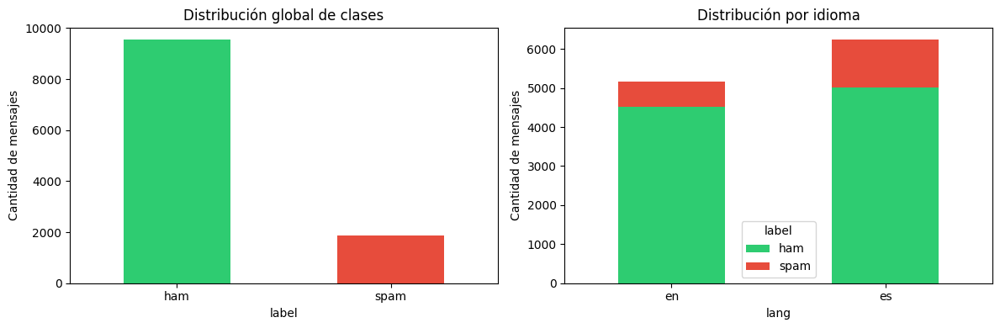
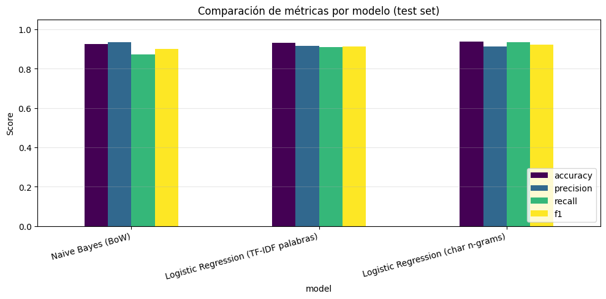
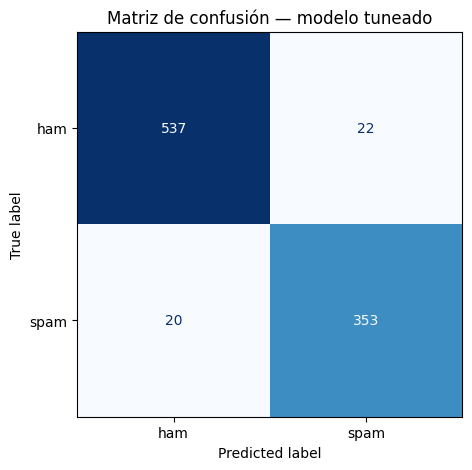

<!--
ESQUELETO DE PRESENTACIÓN PARA LA DEFENSA ORAL (~20 min, 14 slides).
Formato Marp. Para exportar a PDF/PPTX:
    npx @marp-team/marp-cli docs/presentacion.md --pdf
    npx @marp-team/marp-cli docs/presentacion.md --pptx
Las notas del orador van en comentarios <!-- ... --> bajo cada slide.
-->

# Detector de Spam Bilingüe
## Inglés + Español con Machine Learning

**Universidad Nacional** · Curso de Inteligencia Artificial
Prof. Venegas · Junio 2026

Integrante(s): _______________________

<!--
NOTA: Preséntate (30s). Frase gancho: "El 45% del correo mundial es spam, y es
el principal vector de phishing. Hoy les muestro un agente que lo detecta solo,
en dos idiomas, con 96% de acierto."
-->

---

# 1. Problema y motivación

- El **spam** es la puerta de entrada a phishing, fraude y malware.
- Filtros por reglas (*"si contiene FREE → spam"*) se evaden fácilmente.
- Objetivo: un **agente que aprende** a distinguir *spam* de *ham* a partir de datos.
- **Bilingüe** (EN + ES): el phishing localizado (BBVA, SAT, CFE) no lo detecta un modelo solo-inglés.

<!--
NOTA (2 min): Enfatiza el COSTO ASIMÉTRICO: dejar pasar spam (phishing) es peor
que bloquear un mensaje legítimo. Esto justifica priorizar Recall más adelante.
-->

---

# 2. Formulación: clasificación binaria supervisada

Función del agente: **f : texto → {spam, ham} + P(spam)**

| | Variable | Dominio |
|---|---|---|
| Entrada | `text` | Cadena Unicode (EN/ES) |
| Salida | `label` | {spam, ham} |
| Salida aux. | `P(spam)` | [0, 1] |

**PEAS** → Performance: Recall ∙ Environment: mensajes EN/ES ∙ Actuators: etiqueta + confianza ∙ Sensors: texto.
Entorno: observable, un agente, determinístico, episódico, estático. Agente *model-based*.

<!--
NOTA (2 min): Aquí demuestras dominio teórico del curso (PEAS y tipo de entorno).
Si te preguntan "¿por qué episódico?": cada mensaje se clasifica independiente,
una decisión no afecta la siguiente.
-->

---

# 3. Dataset

- **SMS Spam Collection (UCI)** — 5 574 mensajes en inglés (Almeida & Hidalgo, 2011).
- **SMS Multilingual** — 5 572 traducidos al español.
- **spam_ham_spanish (nativo)** — 1 207 mensajes de spam escrito en español + **61 seed** local.
- Combinado y deduplicado: **~11 400 mensajes**, **16.3 % spam** (desbalanceado).

<!--
NOTA (1.5 min): Destaca las 3 fuentes y que el español NO es solo traducción:
añadimos spam nativo. El dataset es DESBALANCEADO (16.3% spam), reflejo de la
realidad. Esto motiva el balanceo y el por qué accuracy sola no basta.
-->

---

# 4. Preprocesamiento

Función `clean_text`:

1. Minúsculas
2. URLs → `__url__`, números → `__num__` *(preserva la señal, no el valor)*
3. Quita HTML y puntuación
4. Stopwords EN + ES (**504** palabras)

> Reemplazar por *tokens* en vez de borrar: la **presencia** de URL/número es predictiva de spam.

<!--
NOTA (1.5 min): El truco de los tokens __url__/__num__ es una decisión de diseño
defendible: generaliza entre idiomas y captura el patrón del spam.
-->

---

# 5. Balanceo y partición

- **Undersampling** de la clase mayoritaria → **4 659** mensajes, ~40 % spam.
- Split **estratificado**: train **3 727** / test **932** (`random_state=42`).
- El test conserva ambos idiomas: 314 EN / 618 ES.

<!--
NOTA (1 min): random_state=42 = reproducibilidad. Estratificado = misma proporción
de spam en train y test. Evita data leakage al vectorizar dentro del pipeline.
-->

---

# 6. Los tres modelos

| # | Modelo | Representación | Tipo |
|---|---|---|---|
| 1 | Naive Bayes | Bag of Words | Generativo |
| 2 | Regresión Logística | TF-IDF palabras | Discriminativo |
| 3 | Regresión Logística | TF-IDF char n-grams | Robusto a typos |

- **Naive Bayes:** P(spam\|palabras) ∝ P(palabras\|spam)·P(spam)
- **Logística:** P(spam\|x) = σ(w·x + b), σ = sigmoide

<!--
NOTA (2.5 min): Explica la INTUICIÓN, no las fórmulas. NB cuenta frecuencias por
clase ("¿qué tan típica es esta palabra en spam?"). Logística traza una frontera
ponderando palabras. Char n-grams mira pedazos de letras → resiste "g4n4 din3ro".
-->

---

# 7. Comparación de modelos (test)

| Modelo | Acc | Prec | Recall | F1 |
|---|---|---|---|---|
| Naive Bayes | 0.924 | 0.934 | 0.871 | 0.902 |
| LogReg TF-IDF | 0.930 | 0.916 | 0.909 | 0.913 |
| **LogReg char n-grams** | 0.938 | 0.911 | **0.936** | **0.923** |

→ Char n-grams es el mejor **sin tunear**; se tunea LogReg-palabras como base.

<!--
NOTA (1.5 min): Con español nativo, char n-grams (agnóstico al idioma) gana sin
tunear. Aun así tuneamos la LogReg de palabras como base, y tras GridSearch +
calibración alcanza el mejor F1 global (0.944, siguiente slide).
-->

---

# 8. Anti-overfitting + tuning

- **Cross-validation (5-fold):** brechas train–CV en F1 ≈ +0.04 a +0.05; char n-grams el más robusto (+0.036), palabras con **sobreajuste leve** (+0.051).
- **GridSearchCV** (18×3 fits): mejor `C=10`, `min_df=1`, `ngram=(1,1)` → **F1 CV 0.939**.
- Modelo final tuneado: **Accuracy 0.955 · F1 0.944**.

<!--
NOTA (1.5 min): Honestidad: el modelo de palabras muestra sobreajuste leve
(curva train 0.999 vs val 0.939). Se mitiga con regularización C y min_df. Char
n-grams generaliza mejor. Más datos nativos seguirían ayudando.
-->

---

# 9. Calibración del threshold

| Threshold | Precision | Recall |
|---|---|---|
| 0.50 (defecto) | 0.941 | 0.946 |
| **0.278 (óptimo)** | 0.851 | **0.976** |

→ Subimos Recall a **97.6 %**: solo se escapa el 2.4 % del spam.

<!--
NOTA (2 min): ESTE es el corazón de la defensa. Mover el umbral materializa la
decisión del PEAS (priorizar Recall). Se sacrifica precisión a cambio de detectar
casi todo el spam. En producción: los positivos van a cuarentena, no se borran.
-->

---

# 10. Evaluación cross-lingual + matriz de confusión

| Idioma | Acc | F1 |
|---|---|---|
| Inglés | 0.968 | 0.962 |
| Español | 0.948 | 0.934 |

42 errores / 932 (**4.5 %**): 22 falsos positivos, 20 falsos negativos.

<!--
NOTA (1.5 min): El modelo generaliza a ambos idiomas. El español rinde algo
menos pero su test es el doble de grande y con spam nativo: número más honesto.
Los errores son mensajes cortos/ambiguos.
-->

---

# 11. Demo en vivo 🔴

Interfaz web con **Gradio** — selector de modelo + slider de threshold:

- "WIN a free iPhone now! http://bit.ly/win" → **SPAM (99%)**
- "Hola, paso por ti a las 7" → **HAM (2%)**
- *(escribe un mensaje del público en vivo y mueve el threshold)*

<!--
NOTA (2 min): ¡Ensaya la demo antes! Ten el notebook ya ejecutado y la celda de
Gradio lista. Muestra las 3 funciones: (1) clasificar un mensaje del público,
(2) cambiar de modelo para comparar, (3) mover el slider de threshold y ver cómo
un mensaje dudoso pasa de HAM a SPAM. Plan B si falla la red: usa la salida de
"vista previa estática" ya guardada en el notebook.
-->

---

# 12. Conclusiones

- Detector bilingüe **end-to-end**: **F1 0.944 · Accuracy 0.955**.
- Recall sobre spam elevado a **97.6 %** vía calibración del threshold.
- **Generaliza** entre idiomas (F1 EN 0.962 / ES 0.934), con español **nativo** real.
- Entregables: notebook reproducible + modelo serializado + interfaz Gradio (selección de modelo y threshold).

**Futuro:** spam español nativo · transformers multilingües (mBERT) · reentrenamiento incremental.

<!--
NOTA (1 min): Cierra conectando con la motivación inicial: "logramos un agente que
detecta el 98% del spam en dos idiomas, defendible como un filtro real de seguridad".
-->

---

# Gracias — ¿Preguntas?

**Apéndice: preguntas técnicas frecuentes y respuestas →**

<!--
Pasa al apéndice solo si preguntan. Mantén la calma y responde con la intuición.
-->

---

# Apéndice — Q&A de defensa

**¿Naive Bayes vs Regresión Logística?**
NB es *generativo* (modela cómo se generan los datos por clase, asume independencia
entre palabras — "naive"). LogReg es *discriminativo* (aprende directo la frontera
spam/ham ponderando palabras). LogReg suele ganar cuando hay suficientes datos.

**¿Por qué char n-grams?**
Capturan trozos de caracteres (ej. "gan", "an4"), resistiendo errores ortográficos
y ofuscación ("V1AGR4"). Son agnósticos al idioma. Aquí GridSearch prefirió palabras
porque el corpus ya está limpio; aportarían más con ofuscación agresiva.

---

# Apéndice — Q&A de defensa (2)

**¿Por qué priorizar Recall y no Accuracy?**
Accuracy engaña en datasets desbalanceados (predecir siempre "ham" da ~87%). El
costo de un falso negativo (phishing que llega) supera al de un falso positivo
(ham en cuarentena). Por eso bajamos el threshold para maximizar Recall.

**¿Cómo evitan el overfitting / data leakage?**
Cross-validation k-fold + curva de aprendizaje (brechas pequeñas). El vectorizador
va DENTRO del `Pipeline`, así se ajusta solo con train en cada fold — sin fuga del test.

**¿Qué es TF-IDF?**
Pondera cada palabra por su frecuencia en el mensaje (TF) penalizada por lo común
que es en todo el corpus (IDF). Resalta palabras discriminativas, no las frecuentes.
