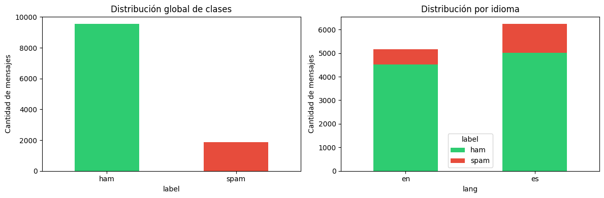
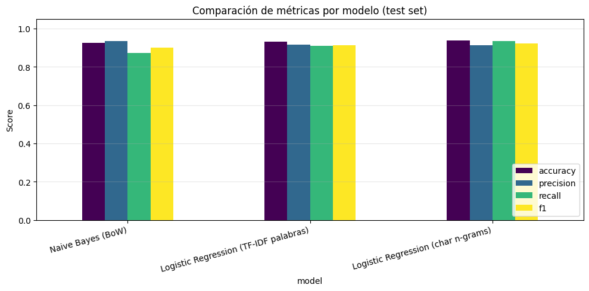
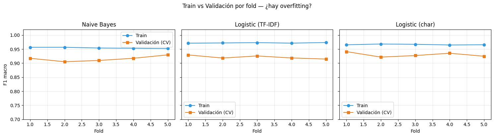
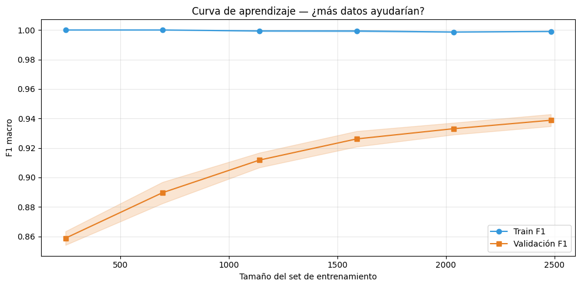
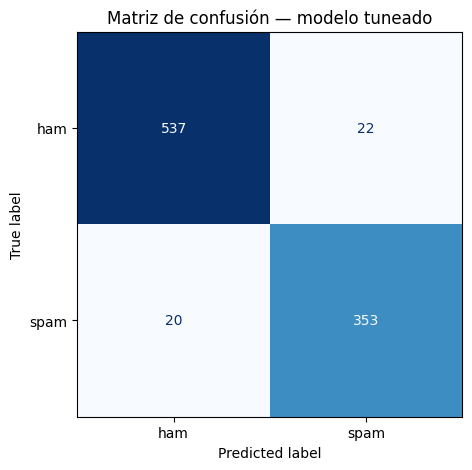
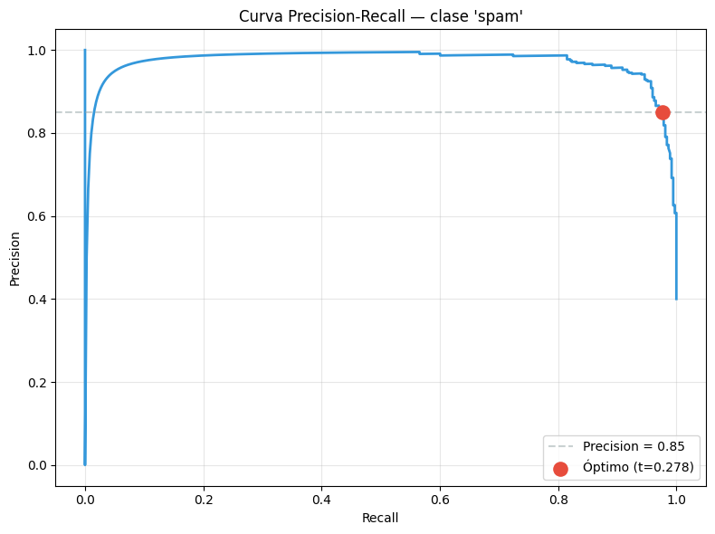
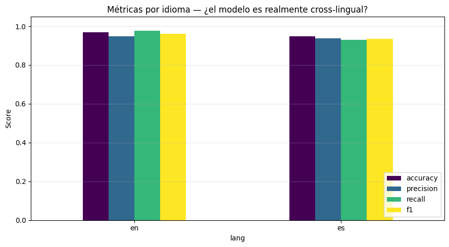

<!--
DIAPOSITIVAS — Detector de Spam Bilingüe
Formato: Markdown con separador de slide `---` y título `##`.
Para convertir a LaTeX/Beamer:  pandoc presentacion.md -t beamer -o slides.pdf
Las notas habladas de cada slide están en guion.md.
Las imágenes están en img/ (ruta relativa).
-->

# Detector de Spam Bilingüe (Inglés + Español)
### Clasificación de mensajes con Machine Learning

**Universidad Nacional** · Curso de Inteligencia Artificial
Profesor: Venegas · Junio 2026
Integrante(s): _______________________

---

## Agenda

1. Objetivo
2. Formulación y PEAS
3. Los datos: corpus bilingüe
4. Preprocesamiento y vectorización
5. Balanceo y partición
6. Los tres modelos
7. Validación, tuning y calibración
8. Métricas y resultados
9. Dificultades y decisiones
10. Sistema interactivo (demo)
11. Conclusiones

---

## 1. Objetivo
 
- **Objetivo:** un agente que **aprende** a distinguir si un mensaje que nunca ha visto es spam.
- Utilizando **Naive Bayes** y **Logistic Regression** como modelos.
- **Bilingüe (EN + ES):** Abarcar dos idiomas para visualizar limitaciones.

---

## 2. Formulación: clasificación binaria supervisada

**Clasificación** (predice categoría) · **binaria** (2 clases) · **supervisada** (datos etiquetados).

$$f:\ \text{texto} \rightarrow \{\text{spam}, \text{ham}\} + P(\text{spam})$$

| | Variable | Dominio |
|---|---|---|
| Entrada | `text` | Cadena Unicode (EN/ES) |
| Salida | `label` | {spam, ham} |
| Salida aux. | `P(spam)` | [0, 1] |

**Regla de decisión:** spam si P(spam) ≥ threshold (calibrado, no 0.5 fijo).

---

## 3. Análisis PEAS del agente

| Componente | Definición |
|---|---|
| **P** — Performance | Accuracy, Precision, Recall, F1. Prioridad: **Recall** sobre spam |
| **E** — Environment | Mensajes EN/ES con URLs, números, errores ortográficos |
| **A** — Actuators | Etiqueta spam/ham + confianza ∈ [0,1] + probabilidades |
| **S** — Sensors | El texto crudo del mensaje |

---

## 4. Tipo de entorno y de agente

- **Observable** (recibe el mensaje completo)
- **Un solo agente** (sin competencia)
- **Determinístico** (mismo texto → misma predicción)
- **Episódico** (cada mensaje es independiente)
- **Estático** (no cambia mientras decide)

**Agente *model-based*:** aprende un modelo interno (pesos/probabilidades) y lo aplica en inferencia.

---

## 5. Los datos: corpus bilingüe (3 fuentes)

| Fuente | Idioma | Mensajes |
|---|---|---|
| SMS Spam Collection (UCI) | Inglés | 5 574 |
| SMS Multilingual (traducido) | Español | 5 572 |
| spam_ham_spanish (**nativo**) | Español | 1 207 |
| Seed phishing local | Español | 61 |

**Corpus:** ~11 400 mensajes · **16.3 % spam** (desbalanceado, fiel a la realidad).

---

## 6. Exploración del corpus (EDA)

- Mayoría ham en ambos idiomas → **desbalance real**.
- El spam suele ser más corto/uniforme; el ham, más variado.
- El corpus se guarda en **caché** (`corpus.parquet`) para reproducibilidad offline.

---

## 7. Preprocesamiento del texto (`clean_text`)

1. Decodifica HTML (`&amp;` → `&`) y elimina etiquetas.
2. URLs → `__url__`, números → `__num__`, emails → `__email__`.
3. Minúsculas, quita puntuación, normaliza espacios.

> **Decisión:** reemplazar por *tokens* en vez de borrar — la **presencia** de una URL es señal de spam, aunque el valor concreto no.

---

## 8. Vectorización: de texto a números

| Técnica | Qué captura |
|---|---|
| **Bag of Words** | Conteo de palabras |
| **TF-IDF** | Palabras ponderadas por relevancia |
| **char n-grams** (`char_wb` 3–5) | Trozos de caracteres → robusto a typos y agnóstico al idioma |

Stopwords EN + ES combinadas (**504** palabras) eliminadas por el vectorizador.

---

## 9. Desbalance y balanceo

- Sin balancear: 84 % ham → el modelo aprende a decir "ham" siempre.
- **Undersampling 1.5:1** (ham:spam) por idioma → conserva todo el spam.

| | ham | spam |
|---|---|---|
| Antes | 9 525 | 1 864 (16 %) |
| Después | 2 795 | 1 864 (**40 %**) |

> Doble defensa: undersampling **+** `class_weight="balanced"` en los modelos.

---

## 10. Partición y Pipeline (evitar *data leakage*)

- `train_test_split` **estratificado**, `random_state=42` → train 3 727 / test 932.
- **Pipeline** = vectorizador + modelo encadenados.

> El vectorizador vive **dentro** del Pipeline → en validación se ajusta solo con el train de cada fold y **nunca ve el test**. Eso evita el *data leakage*.

---

## 11. Los tres modelos

| # | Modelo | Representación | Tipo |
|---|---|---|---|
| 1 | Naive Bayes | Bag of Words | Generativo |
| 2 | Reg. Logística | TF-IDF palabras | Discriminativo |
| 3 | Reg. Logística | char n-grams | Robusto a typos |

- **Naive Bayes:** P(spam\|x) ∝ P(x\|spam)·P(spam) — asume independencia ("naive").
- **Logística:** P(spam\|x) = σ(w·x + b) — frontera lineal, regularización `C`.

---

## 12. Comparación de los tres modelos (test)

| Modelo | Acc | Prec | Recall | F1 |
|---|---|---|---|---|
| Naive Bayes | 0.924 | 0.934 | 0.871 | 0.902 |
| LogReg palabras | 0.930 | 0.916 | 0.909 | 0.913 |
| **LogReg char n-grams** | 0.938 | 0.911 | **0.936** | **0.923** |

---

## 13. Validación cruzada (anti-overfitting)

| Modelo | gap (train − CV) | Veredicto |
|---|---|---|
| Naive Bayes | +0.039 | OK |
| LogReg palabras | +0.051 | ⚠️ sobreajuste leve |
| LogReg char | +0.036 | OK (más robusto) |

---

## 14. Curva de aprendizaje

- F1 train **0.999** vs validación **0.939** → brecha ~0.06.
- Confirma **sobreajuste leve** del modelo de palabras.
- La curva de validación sigue subiendo → **más datos ayudarían**.

---

## 15. Tuning de hiperparámetros (GridSearch)

- Rejilla: `ngram` (2) × `min_df` (3) × `C` (3) = **18 combinaciones** × 3 folds = **54 fits**.
- Mejor: **C=10, min_df=1, ngram=(1,1)** → F1 macro CV **0.939**.

| Métrica (modelo tuneado, test) | Valor |
|---|---|
| Accuracy | **0.955** |
| Precision | 0.941 |
| Recall | 0.946 |
| **F1** | **0.944** |

---

## 16. Métricas: la matriz de confusión

| | Pred. HAM | Pred. SPAM |
|---|---|---|
| **Real HAM** | TN=537 | FP=22 |
| **Real SPAM** | FN=20 | TP=353 |

42 errores / 932 = **4.5 %**.

---

## 17. ¿Por qué cuatro métricas y no una?

- **Accuracy** = (TP+TN)/total — engaña con desbalance.
- **Precision** = TP/(TP+FP) — fiabilidad de la alarma (costo de FP).
- **Recall** = TP/(TP+FN) — spam atrapado (costo de FN, lo prioritario).
- **F1** = media armónica de P y R — castiga el desequilibrio.

> "Todo ham" → Acc 84 %, Recall 0 %. Por eso ninguna métrica sola basta.

---

## 18. Calibración del threshold

| Threshold | Precision | Recall |
|---|---|---|
| 0.50 (defecto) | 0.941 | 0.946 |
| **0.278 (óptimo)** | 0.851 | **0.976** |

> Bajar el umbral → Recall **97.6 %** (solo escapa 2.4 % del spam), a costa de algo de Precision.

---

## 19. Evaluación cross-lingual (por idioma)

| Idioma | n | Accuracy | F1 |
|---|---|---|---|
| Inglés | 314 | 0.968 | 0.962 |
| Español | 618 | 0.948 | 0.934 |

> El español rinde algo menos pero se mide sobre un test más grande y con spam **nativo** → número honesto.

---

## 20. Dificultades y decisiones clave

| Dificultad | Decisión |
|---|---|
| Spam español escaso | 3 fuentes (traducido + nativo + seed) |
| Desbalance 84/16 | Undersampling 1.5:1 + class_weight |
| Etiquetas nativas ruidosas | Probamos *confident learning* → **lo descartamos** (borraba spam bueno) |
| Typos rompen modelos de palabras | char n-grams (robusto a OOV) |
| Naive Bayes sobre-confiado | Elegir LogReg (mejor calibrado) |
| Umbral 0.5 no óptimo | Calibrar a 0.278 (prioridad Recall) |

---

## 22. Resultados finales

- **F1 = 0.944 · Accuracy = 0.955** (modelo tuneado, test).
- **Recall 97.6 %** tras calibrar el threshold (objetivo de seguridad).
- Generaliza entre idiomas: **EN 0.962 / ES 0.934**.
- Sin overfitting grave (validado con CV y curva de aprendizaje).

